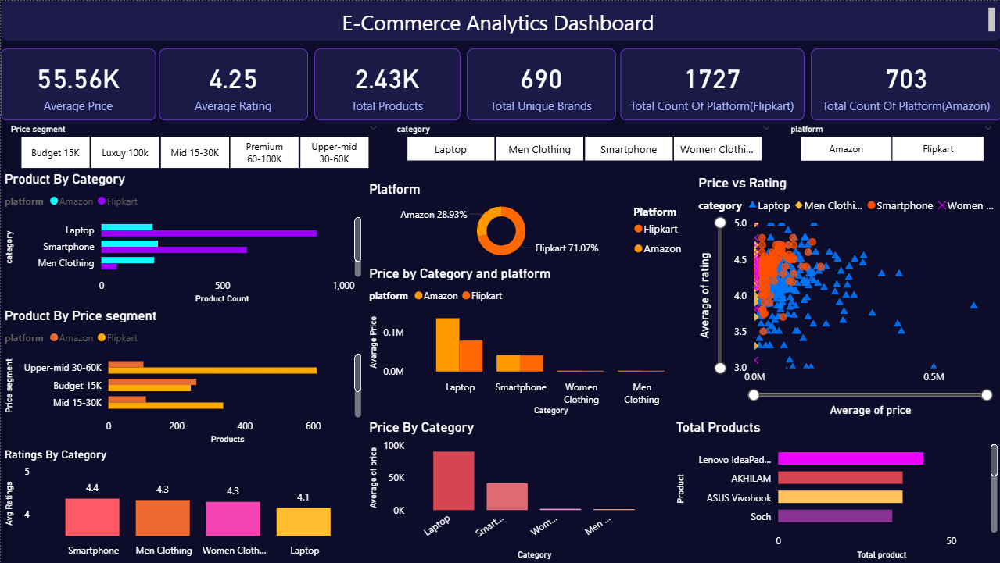
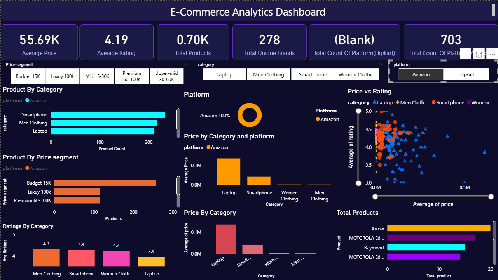

# E-Commerce Platform Comparison Analysis

This project compares product pricing and ratings across multiple e-commerce platforms.

The objective is to identify pricing variations, brand positioning, and rating patterns across platforms.

Tools Used:
- Excel
- Power BI

## Dashboard Preview

