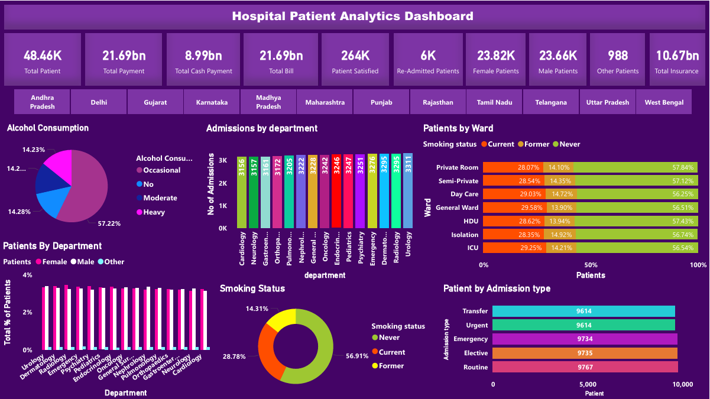

**Overview**

This project focuses on analyzing hospital patient data to uncover meaningful insights related to patient care, ICU utilization, and operational efficiency.
The goal is to transform raw healthcare data into an interactive and decision-support dashboard that highlights trends, patterns, and performance indicators within a hospital environment.

**Objective**
Analyze patient admission and discharge trends
Understand ICU usage and patient stay duration
Identify patterns in hospital resource utilization
Support data-driven decision-making in healthcare operations

**Key Insights**
ICU occupancy trends reveal periods of high demand, indicating potential capacity constraints
Patient length of stay varies significantly, impacting hospital resource allocation
Admission patterns show peak periods which can guide staffing and planning
Data highlights opportunities to optimize patient flow and reduce inefficiencies

**Dashboard Features**
Interactive filters for dynamic data exploration
KPI cards for quick performance overview
Time-based analysis of admissions and ICU usage
Visual breakdown of patient distribution and hospital metrics

**Tools & Technologies**
Power BI – Dashboard development and visualization
Data Cleaning & Transformation – Structured raw data for analysis
Analytical Thinking – Extracted insights and patterns from data

**Dashboard Preview**

