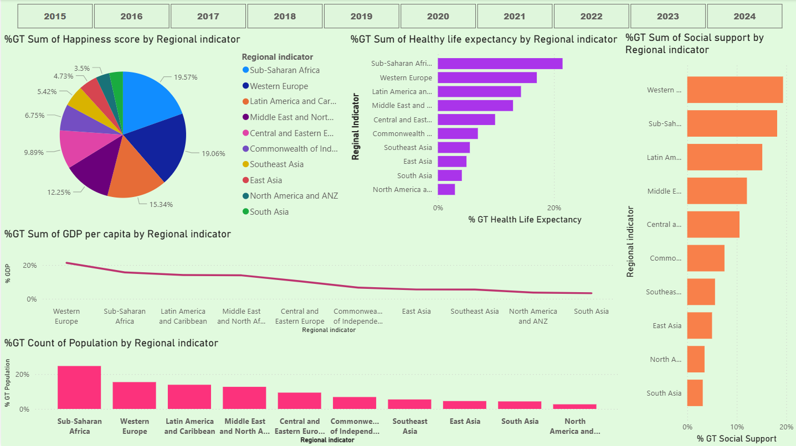

# World Happiness Dataset Analysis

This project analyzes global happiness dataset to study the relationship between happiness score and socio-economic indicators such as GDP, social support, and life expectancy.

The dashboard helps visualize country-level and regional trends.

Tools Used:
- Python
- Power BI

## Dashboard Preview

